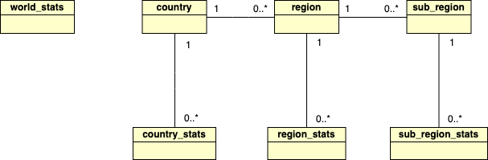

# Covid19 Tracker

## Screens

### Country

<b>List</b>: List view

<p align="left">
  
  
  
</p>

<b>Bar Chart</b>: Bar chart view

<p align="left">
  
  
  
  
</p>

<b>Line Chart</b>: Line chart view

<p align="left">
  
  
</p>

<b>Pie Chart</b>: Line chart view

<p align="left">
  
  
</p>

<b>Pie Chart</b>: Line chart view

<p align="left">
  
  
</p>

<b>Countries & Regions</b>

<p align="left">
  
  
</p>

### World

<b>List</b>: List view

<p align="left">
  
  
  
</p>

<b>Bar Chart</b>: Bar chart view

<p align="left">
  
  
  
  
</p>

<b>Line Chart</b>: Line chart view

<p align="left">
  
  
</p>

### Others

<p align="left">
  
  
  
</p>

## Simplified UML Database

<br />
<p align="left">
  
</p>  

## Initialize Database

There are three ways to initialize the local database:

- <b>By default, using the zip file</b>: This file is in the <i>assets</i> folder and the name is <b>covid19-tracker-db.zip</b>. In the [MainActivity](/app/src/main/java/com/jaimegc/covid19tracker/ui/home/MainActivity.kt) class, the ```fileUtils.initDatabase()``` method unzips the file. After that, the [Covid19TrackerDatabase](/app/src/main/java/com/jaimegc/covid19tracker/data/room/CovidTrackerDatabase.kt) class will load the unzipped file in the ```.createFromFile(File("${context.filesDir}${File.separator}$DATABASE_NAME"))``` method.

- <b>Unzipped file</b>: You need to add this file in the <i>assets</i> folder with the name <b>covid19-tracker-db</b>. In the [Covid19TrackerDatabase](/app/src/main/java/com/jaimegc/covid19tracker/data/room/CovidTrackerDatabase.kt) class you need to replace the line ```.createFromFile(File("${context.filesDir}${File.separator}$DATABASE_NAME"))``` with this one ```.createFromAsset(DATABASE_NAME)```. Also, in the [MainActivity](/app/src/main/java/com/jaimegc/covid19tracker/ui/home/MainActivity.kt) class you need to remove the ```fileUtils.initDatabase()``` method.

- <b>Adding jsons manually</b>: You can add manually the jsons downloaded from ```https://api.covid19tracking.narrativa.com/api/YYYY-MM-DD```. You need to save these files with this format ```YYYY-MM-DD.json``` in the <i>assets/data</i> folder (you can see an example in the [data-jsons](https://github.com/jaimegc/Covid19Tracker/tree/data-jsons) branch). In the [Covid19TrackerDatabase](/app/src/main/java/com/jaimegc/covid19tracker/data/room/CovidTrackerDatabase.kt) class you need to remove the line ```.createFromFile(File("${context.filesDir}${File.separator}$DATABASE_NAME"))``` or ```.createFromFile(File("${context.filesDir}${File.separator}$DATABASE_NAME"))``` and add this code:

```kotlin
.addCallback(object : RoomDatabase.Callback() {
    override fun onCreate(db: SupportSQLiteDatabase) {
        super.onCreate(db)
        val request = OneTimeWorkRequestBuilder<PopulateDatabaseWorker>().build()
        WorkManager.getInstance(context).enqueue(request)
    }
})
```

Also, remove ```fileUtils.initDatabase()``` method from [MainActivity](/app/src/main/java/com/jaimegc/covid19tracker/ui/home/MainActivity.kt). The [PopulateDatabaseWorker](/app/src/main/java/com/jaimegc/covid19tracker/worker/PopulateDatabaseWorker.kt) worker is in charge of creating and populating the database. You can choose a range of days with the variables <i>START_DATE</i> and <i>END_DATE</i>. I recommend using the emulator to generate the database. After that, in the internal folder <i>data/data/com.jaimegc.covid19tracker/databases</i> you can export the <b>covid19-tracker-db</b> file and zip it to be loaded using the first way of this section.

<b>IMPORTANT:</b> The rest of the days, from the last one in the local database until the current one will be downloaded automatically using the [UpdateDatabaseWorker](/app/src/main/java/com/jaimegc/covid19tracker/worker/UpdateDatabaseWorker.kt) worker. The data will be updated every 6 hours.

## TODO List

- Add unit tests, integration tests, UI tests, etc.
- Add GitHub Actions

## Credits

### Special thanks

- [Narrativa COVID-19 Project](https://covid19tracking.narrativa.com) for the open-source API.
- [Covid19-Notifier-IN Android Project](https://github.com/PatilShreyas/Covid19-Notifier-IN) for the inspiration to start this project.
- [MPAndroidChart](https://github.com/PhilJay/MPAndroidChart) for the amazing chart library.

### Thanks

- Code:
  * [Arrow](https://github.com/arrow-kt/arrow)
  * [VirusTrend](https://github.com/pablisco/virustrend)
  * [NavigationKeepFragment](https://github.com/STAR-ZERO/navigation-keep-fragment-sample) 
  * [QueueLiveData](https://stackoverflow.com/questions/56097647/can-we-use-livedata-without-loosing-any-value) 
  * [Mobility Finder](https://github.com/pablodeafsapps/mobility-finder)
- Animations:
  * [Loading & Populating database](https://lottiefiles.com/17895-wear-mask)
  * [Empty chart data](https://lottiefiles.com/17801-stay-at-home)
  * [Loading](https://lottiefiles.com/18466-corona-virus)
- Icons:
  * [Menu List](https://github.com/PatilShreyas/Covid19-Notifier-IN/tree/master/app/src/main/res/drawable)
  * [Launcher & Splash](https://www.flaticon.es/icono-gratis/coronavirus_2746582)
  * [Country](https://pngimage.net/%D1%81%D1%82%D1%80%D0%B0%D0%BD%D0%B0-png-4)

## Contribute

If you want to contribute to this app, you're always welcome!
See [Contributing Guidelines](CONTRIBUTING.md). 

## Author

<table>
  <tr>
    <th height="50">Jaime GC</th>
    <th align="center"><a href="https://es.linkedin.com/in/jaimeguerrerocubero"></a></th>  
  </tr>
</table>

## License

```license
Copyright 2020 Jaime GC

Licensed under the Apache License, Version 2.0 (the "License");
you may not use this file except in compliance with the License.
You may obtain a copy of the License at

    http://www.apache.org/licenses/LICENSE-2.0

Unless required by applicable law or agreed to in writing, software
distributed under the License is distributed on an "AS IS" BASIS,
WITHOUT WARRANTIES OR CONDITIONS OF ANY KIND, either express or implied.
See the License for the specific language governing permissions and
limitations under the License.
```
