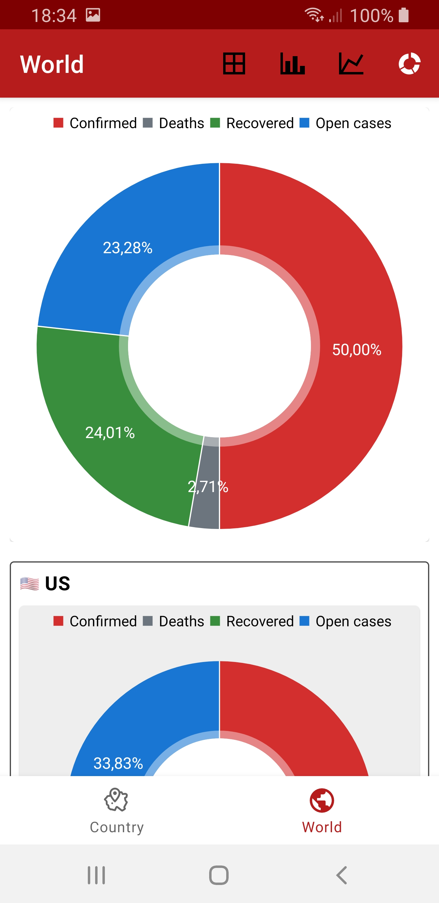
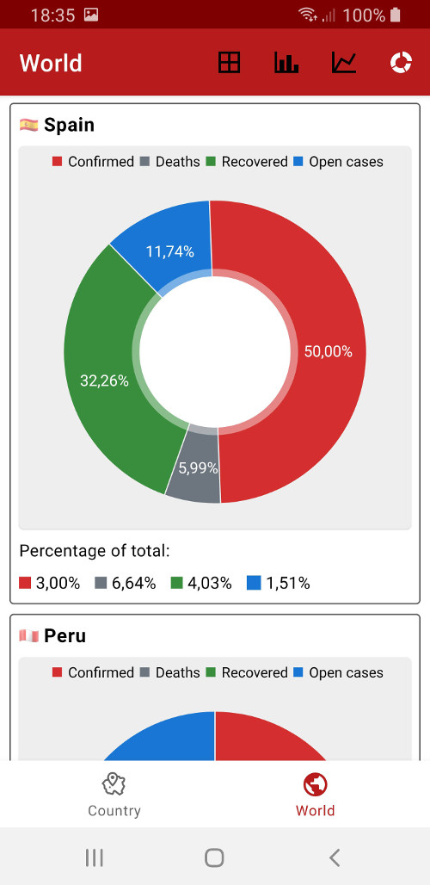
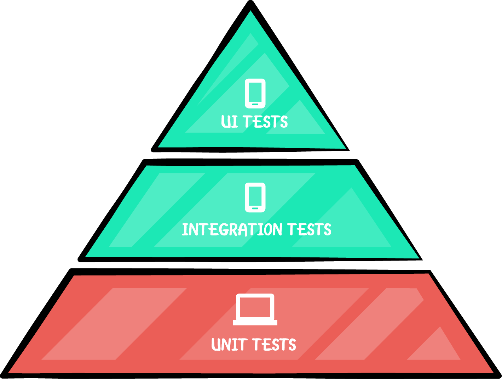
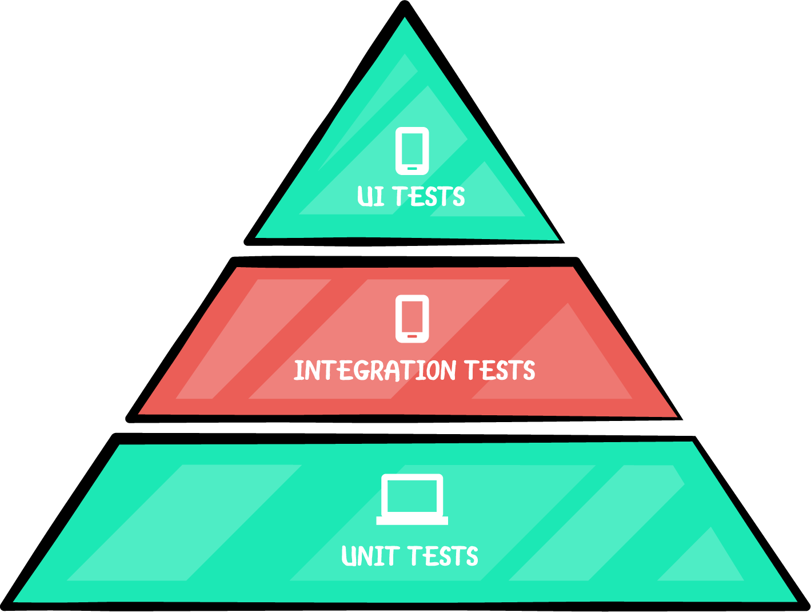
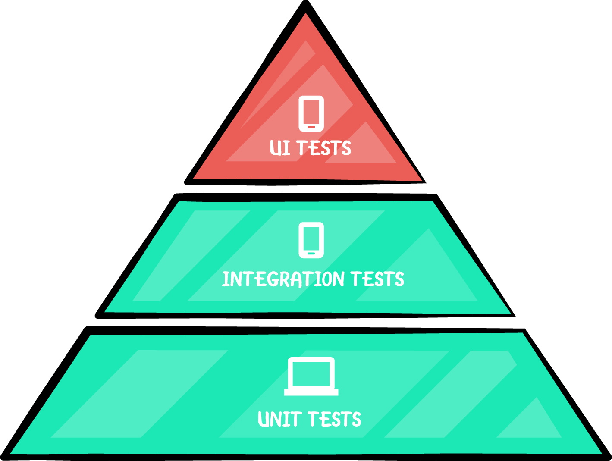

<h1 align="center">Covid19 Tracker</h1>

<p align="center">
  
</p>

<br />

## Introduction

Covid19 Tracker is a sample Android application focused on displaying statistics using graphs and adding tests, tests and more tests (<b>> 1.000</b>). From a technical point of view, it has an <b>Offline-First</b> approach and uses the <b>Single Source of Truth (SSOT)</b> principle. Also, it has been built making use of a huge database and <b>Flow</b> streams with the aim of achieving the best performance. However, it is important to point out that certain technical decisions have been made only for me to have an opportunity to practice new Android concepts.

You can download the app [here](https://dropbox.com/s/ifxiab9fsjkv5dx/covid19tracker.apk).

## Technical summary

- [Offline-First](https://applikeysolutions.com/blog/the-offline-first-approach-to-mobile-app-development): The offline-first apps, while still requiring a connection to the servers, don't need a constant internet connection. The data from servers is downloaded to the user's device and can still be accessed offline.
- [Single Source of Truth (SSOT)](https://developer.android.com/jetpack/docs/guide#truth): It is the practice of structuring information models and associated schemata such that every data element is stored exactly once. You can have an offline app and be sure your data always use one source and that is your database.
- [Model-View-ViewModel (MVVM)](https://en.wikipedia.org/wiki/Model%E2%80%93view%E2%80%93viewmodel): It is a software architectural pattern that facilitates the separation of the development of the graphical user interface (without using [DataBinding](https://developer.android.com/topic/libraries/data-binding)). Also, there are [Screen States](/app/src/main/java/com/jaimegc/covid19tracker/ui/base/states/ScreenStates.kt) to handle the different states in the UI.
- [Android Architecture Components](https://developer.android.com/topic/libraries/architecture): Collection of libraries that help you design robust, testable, and maintainable apps.
  - [LiveData](https://developer.android.com/topic/libraries/architecture/livedata): Data objects that notify views when the underlying database changes.
  - [ViewModel](https://developer.android.com/topic/libraries/architecture/viewmodel): Stores UI-related data that isn't destroyed on UI changes. 
  - [ViewBinding](https://developer.android.com/topic/libraries/view-binding): Generates a binding class for each XML layout file present in that module and allows you to more easily write code that interacts with views.
  - [Room](https://developer.android.com/topic/libraries/architecture/room): The library provides an abstraction layer over SQLite to allow for more robust database access while harnessing the full power of SQLite.
    - [DatabaseView](https://developer.android.com/training/data-storage/room/creating-views): This annotation allows you to encapsulate a query into a class. Room refers to these query-backed classes as views, and they behave the same as simple data objects when used in a DAO.
  - [WorkManager](https://developer.android.com/topic/libraries/architecture/workmanager): The WorkManager API makes it easy to schedule deferrable, asynchronous tasks that are expected to run even if the app exits or device restarts.
  - [Navigation](https://developer.android.com/guide/navigation): This component helps you implement navigation.
  - Custom classes:
    - [QueueLiveData](/app/src/main/java/com/jaimegc/covid19tracker/common/QueueLiveData.kt): This custom LiveData class will deliver values even when they are posted very quickly one after another. It solves the issue of losing values when several new ones are posted very quickly.
    - [KeepStateNavigator](/app/src/main/java/com/jaimegc/covid19tracker/common/KeepStateNavigator.kt): This class is to keep state in fragment navigator.
- [Flow](https://kotlin.github.io/kotlinx.coroutines/kotlinx-coroutines-core/kotlinx.coroutines.flow/-flow/): A cold asynchronous data stream that sequentially emits values and completes normally or with an exception.
  - [zip](https://kotlin.github.io/kotlinx.coroutines/kotlinx-coroutines-core/kotlinx.coroutines.flow/zip.html): Zips values from the current flow (this) with other flow using provided transform function applied to each pair of values. The resulting flow completes as soon as one of the flows completes and cancel is called on the remaining flow.
  - [combine](https://kotlin.github.io/kotlinx.coroutines/kotlinx-coroutines-core/kotlinx.coroutines.flow/combine.html): Returns a Flow whose values are generated with transform function by combining the most recently emitted values by each flow.
  - [flatMapMerge](https://kotlin.github.io/kotlinx.coroutines/kotlinx-coroutines-core/kotlinx.coroutines.flow/flat-map-merge.html): Transforms elements emitted by the original flow by applying transform, that returns another flow, and then merging and flattening these flows. This operator calls transform sequentially and then merges the resulting flows with a concurrency limit on the number of concurrently collected flows.
- [StateFlow](https://kotlin.github.io/kotlinx.coroutines/kotlinx-coroutines-core/kotlinx.coroutines.flow/-state-flow/): A SharedFlow that represents a read-only state with a single updatable data value that emits updates to the value to its collectors. A state flow is a hot flow because its active instance exists independently of the presence of collectors.
- [Testing](https://developer.android.com/training/testing/fundamentals): Unit, instrumentation and UI tests have been implemented. There are more than <b>1.000 tests</b> using different frameworks, libraries, patterns, techniques, etc.
  - [Mockito-Kotlin](https://github.com/mockito/mockito-kotlin): A small library that provides helper functions to work with Mockito in Kotlin.
  - [Mockk](https://mockk.io/): Provides DSL to mock behavior. Built from zero to fit Kotlin language. Supports named parameters, object mocks, coroutines and extension function mocking.
  - [Espresso](https://developer.android.com/training/testing/espresso): Writing concise, beautiful, and reliable Android UI tests.
  - [Screen Robot Pattern](https://academy.realm.io/posts/kau-jake-wharton-testing-robots/): This pattern fits with Espresso and allows to create clear and understandable tests.
  - [Kakao](https://github.com/agoda-com/Kakao): Nice and simple DSL for Espresso in Kotlin.
  - [Barista](https://github.com/AdevintaSpain/Barista): Barista makes developing UI test faster, easier and more predictable. Built on top of Espresso, it provides a simple and discoverable API, removing most of the boilerplate and verbosity of common Espresso tasks.
  - [Robolectric](http://robolectric.org/): Robolectric lets you run your tests on your workstation, or on your continuous integration environment in a regular JVM, without an emulator. Running tests on an Android emulator or device is slow!
  - [Kotest](https://kotest.io/): Kotest is a flexible and comprehensive testing tool for Kotlin with <b>multiplatform support</b>.
  - [Turbine](https://github.com/cashapp/turbine): Turbine is a small testing library for kotlinx.coroutines flow. 
  - [Flow-Test-Observer](https://github.com/ologe/flow-test-observer): Library inspired by TestSubscriber from RxJava. Works with both cold/finite and hot/infinite flow.
  - [MockWebServer](https://github.com/square/okhttp/tree/master/mockwebserver): A scriptable web server for testing HTTP clients.
  - [Google Truth](https://github.com/google/truth): Truth makes your test assertions and failure messages more readable. 
- [Arrow](https://github.com/arrow-kt/arrow): It is a library for Typed Functional Programming in Kotlin.
  - [Either](https://arrow-kt.io/docs/0.10/apidocs/arrow-core-data/arrow.core/-either/): Represents the presence of either a Left value or a Right value. By convention, most functional programming libraries choose Left as the exceptional case and Right as the success value.
  - [IO](https://arrow-kt.io/docs/0.10/effects/io/): It is used to represent operations that can be executed lazily, and are capable of failing, generally with exceptions. This means that code wrapped inside IO will not throw exceptions until it is run, and those exceptions can be captured inside IO for the user to check. In this project, it has only been used in the [UpdateDatabaseWorker](/app/src/main/java/com/jaimegc/covid19tracker/worker/UpdateDatabaseWorker.kt) worker to build concurrent API calls.
- [Koin](https://start.insert-koin.io/): Dependency Injection Framework (Kotlin)
- [Moshi](https://github.com/square/moshi) & [Moshi Converter](https://github.com/square/retrofit/tree/master/retrofit-converters/moshi): A modern JSON library for Kotlin and Java. The converter uses Moshi for serialization to and from JSON.
- [Detekt](https://github.com/detekt/detekt): A static code analysis tool for the Kotlin programming language. It operates on the abstract syntax tree provided by the Kotlin compiler.
- [Kotlin Gradle DSL](https://docs.gradle.org/current/userguide/kotlin_dsl.html): Gradle's Kotlin DSL provides an alternative syntax to the traditional Groovy DSL with an enhanced editing experience in supported IDEs, with superior content assist, refactoring, documentation, and more.
- [Remal check dependency update](https://plugins.gradle.org/plugin/name.remal.check-dependency-updates): Plugin that provides task for discovering dependency updates.
- [GitHub Actions](https://github.com/features/actions): Automate, customize, and execute your software development workflows right in your repository. Discover, create, and share actions to perform any job, including CI/CD, and combine actions in a completely customized workflow.

## Screens

### Country

<b>List</b>

<p align="left">
  
  
  
</p>

<b>Bar Charts</b>

<p align="left">
  
  
  
  
</p>

<b>Line Charts</b>

<p align="left">
  
  
</p>

<b>Pie Charts</b>

<p align="left">
  
  
</p>

<b>Countries & Regions</b>

<p align="left">
  
  
</p>

### World

<b>List</b>

<p align="left">
  
  
  
</p>

<b>Bar Charts</b>

<p align="left">
  
  
  
  
</p>

<b>Line Charts</b>

<p align="left">
  
  
</p>

<b>Pie Charts</b>

<p align="left">
  
  
</p>

### Others

<p align="left">
  
  
  
</p>

### GIF

<p align="left">
  
</p>

## Simplified UML Database

<br />
<p align="left">
  
</p>  

### Database rows from 2020/01/23 until 2021/02/13

- country: 194
- region: 418
- sub_region: 3.208
- world_stats: 388
- country_stats: 74.299
- region_stats: 158.573
- sub_region_stats: 1.244.704

## Initialize Database

There are three ways to initialize the local database:

- <b>By default, using the zip file</b>: This file is in the <i>assets</i> folder and its name is <b>covid19-tracker-db.zip</b>. In the [MainActivity](/app/src/main/java/com/jaimegc/covid19tracker/ui/home/MainActivity.kt) class, the ```fileUtils.initDatabase()``` method unzips this file. After that, the [Covid19TrackerDatabase](/app/src/main/java/com/jaimegc/covid19tracker/data/room/CovidTrackerDatabase.kt) class loads the unzipped file in the ```.createFromFile(File("${context.filesDir}${File.separator}$DATABASE_NAME"))``` method.

- <b>Unzipped file</b>: You need to add this file in the <i>assets</i> folder with the name <b>covid19-tracker-db</b>. In the [Covid19TrackerDatabase](/app/src/main/java/com/jaimegc/covid19tracker/data/room/CovidTrackerDatabase.kt) class you need to replace the line ```.createFromFile(File("${context.filesDir}${File.separator}$DATABASE_NAME"))``` with this one ```.createFromAsset(DATABASE_NAME)```. Also, in the [MainActivity](/app/src/main/java/com/jaimegc/covid19tracker/ui/home/MainActivity.kt) class you need to remove the ```fileUtils.initDatabase()``` method.

- <b>Adding jsons manually</b>: You can manually add the jsons downloaded from ```https://api.covid19tracking.narrativa.com/api/YYYY-MM-DD```. You need to save these files with this format ```YYYY-MM-DD.json``` in the <i>assets/data</i> folder. In the [Covid19TrackerDatabase](/app/src/main/java/com/jaimegc/covid19tracker/data/room/CovidTrackerDatabase.kt) class you need to remove the line ```.createFromFile(File("${context.filesDir}${File.separator}$DATABASE_NAME"))``` and ```.createFromAsset(DATABASE_NAME)``` and add this piece of code:

  ```kotlin
  .addCallback(object : RoomDatabase.Callback() {
      override fun onCreate(db: SupportSQLiteDatabase) {
          super.onCreate(db)
          val request = OneTimeWorkRequestBuilder<PopulateDatabaseWorker>().build()
          WorkManager.getInstance(context).enqueue(request)
      }
  })
  ```

  Also, remove the ```fileUtils.initDatabase()``` method from [MainActivity](/app/src/main/java/com/jaimegc/covid19tracker/ui/home/MainActivity.kt). The [PopulateDatabaseWorker](/app/src/main/java/com/jaimegc/covid19tracker/worker/PopulateDatabaseWorker.kt) worker is in charge of creating and populating the database. You can choose a date range using the variables <i>START_DATE</i> and <i>END_DATE</i>. I recommend using the emulator to generate the database. After that, in the internal folder <i>data/data /com.jaimegc.covid19tracker/databases</i> you can export the <b>covid19-tracker-db</b> file and zip it it in order for it to be loaded following the first of the three methods explained in this section.

The data for any other day, from the last one in the local database until the current one, will be downloaded automatically using the [UpdateDatabaseWorker](/app/src/main/java/com/jaimegc/covid19tracker/worker/UpdateDatabaseWorker.kt) worker. The data will be updated every 6 hours.

<b>⚠️ WARNING: ⚠️</b> The data provided and used for the generation of these products comes from the aggregation of different sources, each of which with different update times and frequencies. Additionally, each country has its own accounting criteria, so comparisons of data between countries or regions, and even within them over time, may not be representative of reality. An example is the case of positive cases that depend not only on the spread of the disease but also on the number of tests that are carried out.

## Tests, tests and more tests

The tests are a mix of different frameworks, libraries, patterns, techniques, etc. You can see the same tests written differently.   

<p align="left">
  
</p>

### Unit Tests (712 ✅)

- ViewModels: 60 ✅
  - [CountryViewModel](/app/src/test/java/com/jaimegc/covid19tracker/viewmodel/CountryViewModelTest.kt): 26 ✔️
  - [WorldViewModel](/app/src/test/java/com/jaimegc/covid19tracker/viewmodel/WorldViewModelTest.kt): 25 ✔️
  - [MainViewModel](/app/src/test/java/com/jaimegc/covid19tracker/viewmodel/MainViewModelTest.kt): 9 ✔️
- ViewModels (Kotest): 32 ✅
  - [WorldViewModel-Kotest](/app/src/test/java/com/jaimegc/covid19tracker/viewmodel/kotest/WorldViewModelKotestTest.kt): 12 ✔️
  - [CountryViewModel-Kotest](/app/src/test/java/com/jaimegc/covid19tracker/viewmodel/kotest/CountryViewModelKotestTest.kt): 11 ✔️
  - [MainViewModel-Kotest](/app/src/test/java/com/jaimegc/covid19tracker/viewmodel/kotest/MainViewModelKotestTest.kt): 9 ✔️  
- UseCases: 107 ✅
  - [GetRegionStats](/app/src/test/java/com/jaimegc/covid19tracker/usecase/GetRegionStatsTest.kt): 24 ✔️
  - [GetCountryStats](/app/src/test/java/com/jaimegc/covid19tracker/usecase/GetCountryStatsTest.kt): 20 ✔️
  - [GetSubRegionStats](/app/src/test/java/com/jaimegc/covid19tracker/usecase/GetSubRegionStatsTest.kt): 18 ✔️
  - [GetCountry](/app/src/test/java/com/jaimegc/covid19tracker/usecase/GetCountryTest.kt): 9 ✔️
  - [GetCovidTracker](/app/src/test/java/com/jaimegc/covid19tracker/usecase/GetCovidTrackerTest.kt): 9 ✔️
  - [GetWorldAndCountries](/app/src/test/java/com/jaimegc/covid19tracker/usecase/GetWorldAndCountriesTest.kt): 9 ✔️
  - [GetWorldStats](/app/src/test/java/com/jaimegc/covid19tracker/usecase/GetWorldStatsTest.kt): 9 ✔️
  - [GetRegion](/app/src/test/java/com/jaimegc/covid19tracker/usecase/GetRegionTest.kt): 6 ✔️
  - [GetDates](/app/src/test/java/com/jaimegc/covid19tracker/usecase/GetDatesTest.kt): 2 ✔️
  - [AddCovidTracker](/app/src/test/java/com/jaimegc/covid19tracker/usecase/AddCovidTrackerTest.kt): 1 ✔️
- UseCases (Kotest): 107 ✅
  - [GetRegionStats-Kotest](/app/src/test/java/com/jaimegc/covid19tracker/usecase/kotest/GetRegionStatsKotestTest.kt): 24 ✔️
  - [GetCountryStats-Kotest](/app/src/test/java/com/jaimegc/covid19tracker/usecase/kotest/GetCountryStatsKotestTest.kt): 20 ✔️
  - [GetSubRegionStats-Kotest](/app/src/test/java/com/jaimegc/covid19tracker/usecase/kotest/GetSubRegionStatsKotestTest.kt): 18 ✔️
  - [GetCountry-Kotest](/app/src/test/java/com/jaimegc/covid19tracker/usecase/kotest/GetCountryKotestTest.kt): 9 ✔️ 
  - [GetCovidTracker-Kotest](/app/src/test/java/com/jaimegc/covid19tracker/usecase/kotest/GetCovidTrackerKotestTest.kt): 9 ✔️
  - [GetWorldAndCountries-Kotest](/app/src/test/java/com/jaimegc/covid19tracker/usecase/kotest/GetWorldAndCountriesKotestTest.kt): 9 ✔️
  - [GetWorldStats-Kotest](/app/src/test/java/com/jaimegc/covid19tracker/usecase/kotest/GetWorldStatsKotestTest.kt): 9 ✔️
  - [GetRegion-Kotest](/app/src/test/java/com/jaimegc/covid19tracker/usecase/kotest/GetRegionKotestTest.kt): 6 ✔️
  - [GetDates-Kotest](/app/src/test/java/com/jaimegc/covid19tracker/usecase/kotest/GetDatesKotestTest.kt): 2 ✔️
  - [AddCovidTracker-Kotest](/app/src/test/java/com/jaimegc/covid19tracker/usecase/kotest/AddCovidTrackerKotestTest.kt): 1 ✔️
- Repositories: 59 ✅
  - [CovidTrackerRepository](/app/src/test/java/com/jaimegc/covid19tracker/repository/CovidTrackerRepositoryTest.kt): 59 ✔️
- Repositories (Kotest): 59 ✅
  - [CovidTrackerRepository-Kotest](/app/src/test/java/com/jaimegc/covid19tracker/repository/kotest/CovidTrackerRepositoryKotestTest.kt): 59 ✔️  
- Datasources: 72 ✅
  - [LocalCovidTrackerDatasource](/app/src/test/java/com/jaimegc/covid19tracker/datasource/LocalCovidTrackerDatasourceTest.kt): 67 ✔️
  - [RemoteCovidTrackerDatasource](/app/src/test/java/com/jaimegc/covid19tracker/datasource/RemoteCovidTrackerDatasourceTest.kt): 5 ✔️
- Datasources (Kotest): 72 ✅
  - [LocalCovidTrackerDatasource-Kotest](/app/src/test/java/com/jaimegc/covid19tracker/datasource/kotest/LocalCovidTrackerDatasourceKotestTest.kt): 67 ✔️
  - [RemoteCovidTrackerDatasource-Kotest](/app/src/test/java/com/jaimegc/covid19tracker/datasource/kotest/RemoteCovidTrackerDatasourceKotestTest.kt): 5 ✔️  
- Mappers: 63 ✅
  - [DomainMapper](/app/src/test/java/com/jaimegc/covid19tracker/mapper/DomainMapperTest.kt): 30 ✔️
  - [UIMapper](/app/src/test/java/com/jaimegc/covid19tracker/mapper/UIMapperTest.kt): 22 ✔️
  - [EntityMapper](/app/src/test/java/com/jaimegc/covid19tracker/mapper/EntityMapperTest.kt): 8 ✔️
  - [PojoMapper](/app/src/test/java/com/jaimegc/covid19tracker/mapper/PojoMapperTest.kt): 3 ✔️
- Mappers (Kotest): 63 ✅
  - [DomainMapper-Kotest](/app/src/test/java/com/jaimegc/covid19tracker/mapper/kotest/DomainMapperKotestTest.kt): 30 ✔️
  - [UIMapper-Kotest](/app/src/test/java/com/jaimegc/covid19tracker/mapper/kotest/UIMapperKotestTest.kt): 22 ✔️
  - [EntityMapper-Kotest](/app/src/test/java/com/jaimegc/covid19tracker/mapper/kotest/EntityMapperKotestTest.kt): 8 ✔️
  - [PojoMapper-Kotest](/app/src/test/java/com/jaimegc/covid19tracker/mapper/kotest/PojoMapperKotestTest.kt): 3 ✔️
- Extensions: 9 ✅
  - [NumberExtension](/app/src/test/java/com/jaimegc/covid19tracker/extension/NumberExtensionTest.kt): 6 ✔️
  - [DateExtension](/app/src/test/java/com/jaimegc/covid19tracker/extension/DateExtensionTest.kt): 3 ✔️
- Extensions (Kotest): 9 ✅
  - [NumberExtension-Kotest](/app/src/test/java/com/jaimegc/covid19tracker/extension/kotest/NumberExtensionKotestTest.kt): 6 ✔️
  - [DateExtension-Kotest](/app/src/test/java/com/jaimegc/covid19tracker/extension/kotest/DateExtensionKotestTest.kt): 3 ✔️
  
<p align="left">
  
</p>

### Integration Tests (122 ✅)

- Daos: 42 ✅
  - [RegionStatsDao](/app/src/androidTest/java/com/jaimegc/covid19tracker/room/RegionStatsDaoTest.kt): 15 ✔️
  - [SubRegionStatsDao](/app/src/androidTest/java/com/jaimegc/covid19tracker/room/SubRegionStatsDaoTest.kt): 12 ✔️
  - [CountryStatsDao](/app/src/androidTest/java/com/jaimegc/covid19tracker/room/CountryStatsDaoTest.kt): 8 ✔️
  - [CovidTrackerDao](/app/src/androidTest/java/com/jaimegc/covid19tracker/room/CovidTrackerDaoTest.kt): 2 ✔️
  - [RegionDao](/app/src/androidTest/java/com/jaimegc/covid19tracker/room/RegionDaoTest.kt): 2 ✔️
  - [WorldStatsDao](/app/src/androidTest/java/com/jaimegc/covid19tracker/room/WorldStatsDaoTest.kt): 2 ✔️
  - [CountryDao](/app/src/androidTest/java/com/jaimegc/covid19tracker/room/CountryDaoTest.kt): 1 ✔️
- Daos (Robolectric): 42 ✅
  - [RegionStatsDao-Robolectric](/app/src/test/java/com/jaimegc/covid19tracker/room/RegionStatsDaoRobolectricTest.kt): 15 ✔️
  - [SubRegionStatsDao-Robolectric](/app/src/test/java/com/jaimegc/covid19tracker/room/SubRegionStatsDaoRobolectricTest.kt): 12 ✔️
  - [CountryStatsDao-Robolectric](/app/src/test/java/com/jaimegc/covid19tracker/room/CountryStatsDaoRobolectricTest.kt): 8 ✔️
  - [CovidTrackerDao-Robolectric](/app/src/test/java/com/jaimegc/covid19tracker/room/CovidTrackerDaoRobolectricTest.kt): 2 ✔️
  - [RegionDao-Robolectric](/app/src/test/java/com/jaimegc/covid19tracker/room/RegionDaoRobolectricTest.kt): 2 ✔️
  - [WorldStatsDao-Robolectric](/app/src/test/java/com/jaimegc/covid19tracker/room/WorldStatsDaoRobolectricTest.kt): 2 ✔️
  - [CountryDao-Robolectric](/app/src/test/java/com/jaimegc/covid19tracker/room/CountryDaoRobolectricTest.kt): 1 ✔️
- ApiClients: 10 ✅
  - [CovidTrackerDatasourceApiClient](/app/src/test/java/com/jaimegc/covid19tracker/apiclient/CovidTrackerApiClientTest.kt): 10 ✔️
- ApiClients (Kotest): 10 ✅
  - [CovidTrackerDatasourceApiClient-Kotest](/app/src/test/java/com/jaimegc/covid19tracker/apiclient/kotest/CovidTrackerApiClientKotestTest.kt): 10 ✔️
- SharedPreferences: 4 ✅
  - [CountryPreferences](/app/src/androidTest/java/com/jaimegc/covid19tracker/preference/CountryPreferencesTest.kt): 2 ✔️
  - [CovidTrackerPreferences](/app/src/androidTest/java/com/jaimegc/covid19tracker/preference/CovidTrackerPreferencesTest.kt): 2 ✔️
- SharedPreferences (Robolectric): 4 ✅
  - [CountryPreferences-Robolectric](/app/src/test/java/com/jaimegc/covid19tracker/preference/CountryPreferencesRobolectricTest.kt): 2 ✔️
  - [CovidTrackerPreferences-Robolectric](/app/src/test/java/com/jaimegc/covid19tracker/preference/CovidTrackerPreferencesRobolectricTest.kt): 2 ✔️
- Workers: 5 ✅
  - [UpdateDatabaseWorker](/app/src/androidTest/java/com/jaimegc/covid19tracker/worker/UpdateDatabaseWorkerTest.kt): 5 ✔️
- Workers (Robolectric): 5 ✅
  - [UpdateDatabaseWorker-Robolectric](/app/src/test/java/com/jaimegc/covid19tracker/worker/UpdateDatabaseWorkerRobolectricTest.kt): 5 ✔️     
  
<p align="left">
  
</p>

### UI Tests (259 ✅)

- Activities: 8 ✅
  - [MainActivity](/app/src/androidTest/java/com/jaimegc/covid19tracker/activity/MainActivityTest.kt): 4 ✔️
  - [InitializeDatabaseActivity](/app/src/androidTest/java/com/jaimegc/covid19tracker/activity/InitializeDatabaseActivityTest.kt): 4 ✔️
- Activities (Robolectric): 8 ✅
  - [MainActivity-Robolectric](/app/src/test/java/com/jaimegc/covid19tracker/activity/MainActivityRobolectricTest.kt): 4 ✔️
  - [InitializeDatabaseActivity-Robolectric](/app/src/test/java/com/jaimegc/covid19tracker/activity/InitializeDatabaseActivityRobolectricTest.kt): 4 ✔️
- Activities (Kakao): 5 ✅
  - [MainActivity-Kakao](/app/src/androidTest/java/com/jaimegc/covid19tracker/activity/kakao/MainActivityKakaoTest.kt): 3 ✔️
  - [InitializeDatabaseActivity-Kakao](/app/src/androidTest/java/com/jaimegc/covid19tracker/activity/kakao/InitializeDatabaseActivityKakaoTest.kt): 2 ✔️
- Activities (Barista): 3 ✅
  - [MainActivity-Barista](/app/src/androidTest/java/com/jaimegc/covid19tracker/activity/barista/MainActivityBaristaTest.kt): 3 ✔️
- Activities (ScreenRobot): 5 ✅ 
  - [MainActivity-ScreenRobot](/app/src/androidTest/java/com/jaimegc/covid19tracker/activity/screenrobot/MainActivityScreenRobotTest.kt): 3 ✔️
  - [InitializeDatabaseActivity-ScreenRobot](/app/src/androidTest/java/com/jaimegc/covid19tracker/activity/screenrobot/InitializeDatabaseActivityScreenRobotTest.kt): 2 ✔️
- Fragments: 46 ✅
  - [CountryFragment](/app/src/androidTest/java/com/jaimegc/covid19tracker/fragment/CountryFragmentTest.kt): 37 ✔️
  - [WorldFragment](/app/src/androidTest/java/com/jaimegc/covid19tracker/fragment/WorldFragmentTest.kt): 9 ✔️
- Fragments (Robolectric): 46 ✅
  - [CountryFragment-Robolectric](/app/src/test/java/com/jaimegc/covid19tracker/fragment/CountryFragmentRobolectricTest.kt): 37 ✔️
  - [WorldFragment-Robolectric](/app/src/test/java/com/jaimegc/covid19tracker/fragment/WorldFragmentRobolectricTest.kt): 9 ✔️
- Fragments (Kakao): 46 ✅
  - [CountryFragment-Kakao](/app/src/androidTest/java/com/jaimegc/covid19tracker/fragment/kakao/CountryFragmentKakaoTest.kt): 37 ✔️
  - [WorldFragment-Kakao](/app/src/androidTest/java/com/jaimegc/covid19tracker/fragment/kakao/WorldFragmentKakaoTest.kt): 9 ✔️
- Fragments (Barista): 46 ✅
  - [CountryFragment-Barista](/app/src/androidTest/java/com/jaimegc/covid19tracker/fragment/barista/CountryFragmentBaristaTest.kt): 37 ✔️
  - [WorldFragment-Barista](/app/src/androidTest/java/com/jaimegc/covid19tracker/fragment/barista/WorldFragmentBaristaTest.kt): 9 ✔️
- Fragments (ScreenRobot): 46 ✅
  - [CountryFragment-ScreenRobot](/app/src/androidTest/java/com/jaimegc/covid19tracker/fragment/screenrobot/CountryFragmentScreenRobotTest.kt): 37 ✔️
  - [WorldFragment-ScreenRobot](/app/src/androidTest/java/com/jaimegc/covid19tracker/fragment/screenrobot/WorldFragmentScreenRobotTest.kt): 9 ✔️

### GitHub Actions

You can see the config file [here](./.github/workflows/android-workflow.yaml).

## Gradle tasks

- ```./gradlew detektAll```: Code analysis. More information [here](https://github.com/detekt/detekt#features).
- ```./gradlew checkDependencyUpdates```: Check dependency updates.

## Credits

### Special thanks

- [Narrativa COVID-19 Project](https://covid19tracking.narrativa.com) for the open-source API.
- [Covid19-Notifier-IN Android Project](https://github.com/PatilShreyas/Covid19-Notifier-IN) for the inspiration to start this project.
- [MPAndroidChart](https://github.com/PhilJay/MPAndroidChart) for the amazing chart library.

### Thanks

- Code:
  * [Arrow](https://github.com/arrow-kt/arrow)
  * [VirusTrend](https://github.com/pablisco/virustrend)
  * [NavigationKeepFragment](https://github.com/STAR-ZERO/navigation-keep-fragment-sample) 
  * [QueueLiveData](https://stackoverflow.com/questions/56097647/can-we-use-livedata-without-loosing-any-value) 
  * [Mobility Finder](https://github.com/pablodeafsapps/mobility-finder)
- Animations:
  * [Loading & Populating database](https://lottiefiles.com/17895-wear-mask)
  * [Empty chart data](https://lottiefiles.com/17801-stay-at-home)
  * [Loading](https://lottiefiles.com/18466-corona-virus)
- Icons & Images:
  * [Menu List](https://github.com/PatilShreyas/Covid19-Notifier-IN/tree/master/app/src/main/res/drawable)
  * [Launcher & Splash](https://www.flaticon.es/icono-gratis/coronavirus_2746582)
  * [Country](https://pngimage.net/%D1%81%D1%82%D1%80%D0%B0%D0%BD%D0%B0-png-4)
  * [Test Pyramid](https://www.raywenderlich.com/books/android-test-driven-development-by-tutorials/v1.0)

## Contribute

If you want to contribute to this app, you're always welcome!
See [Contributing Guidelines](CONTRIBUTING.md). 

You can improve the code, adding screenshot tests, themes, compose, modularization, etc.

## Author

<table>
  <tr>
    <th height="50">Jaime GC</th>
    <th align="center"><a href="https://es.linkedin.com/in/jaimeguerrerocubero"></a></th>  
  </tr>
</table>

## License

```license
Copyright 2020 Jaime GC

Licensed under the Apache License, Version 2.0 (the "License");
you may not use this file except in compliance with the License.
You may obtain a copy of the License at

    http://www.apache.org/licenses/LICENSE-2.0

Unless required by applicable law or agreed to in writing, software
distributed under the License is distributed on an "AS IS" BASIS,
WITHOUT WARRANTIES OR CONDITIONS OF ANY KIND, either express or implied.
See the License for the specific language governing permissions and
limitations under the License.
```
